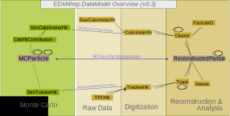

[](https://github.com/key4hep/EDM4hep/actions/workflows/key4hep_linux.yml)
[](https://github.com/key4hep/EDM4hep/actions/workflows/lcg_linux_with_podio.yml)
# EDM4hep


A generic event data model for future HEP collider experiments.



**Componets**

| | | |
|-|-|-|
| [Vector3f ](https://github.com/key4hep/EDM4hep/blob/master/edm4hep.yaml#L9) | [Vector3d ](https://github.com/key4hep/EDM4hep/blob/master/edm4hep.yaml#L24)   | [Vector2i](https://github.com/key4hep/EDM4hep/blob/master/edm4hep.yaml#L40)  |
| [Vector2f](https://github.com/key4hep/EDM4hep/blob/master/edm4hep.yaml#L54) | [TrackState ](https://github.com/key4hep/EDM4hep/blob/master/edm4hep.yaml#L68) | [ObjectID](https://github.com/key4hep/EDM4hep/blob/master/edm4hep.yaml#L91)  |


**Datatypes**

| | | |
|-|-|-|
| [EventHeader](https://github.com/key4hep/EDM4hep/blob/master/edm4hep.yaml#L129)         | [MCParticle](https://github.com/key4hep/EDM4hep/blob/master/edm4hep.yaml#L139)        | [SimTrackerHit](https://github.com/key4hep/EDM4hep/blob/master/edm4hep.yaml#L207)         |
| [CaloHitContribution](https://github.com/key4hep/EDM4hep/blob/master/edm4hep.yaml#L241) | [SimCalorimeterHit](https://github.com/key4hep/EDM4hep/blob/master/edm4hep.yaml#L254) | [RawCalorimeterHit](https://github.com/key4hep/EDM4hep/blob/master/edm4hep.yaml#L266)     |
| [CalorimeterHit](https://github.com/key4hep/EDM4hep/blob/master/edm4hep.yaml#L274)      | [ParticleID](https://github.com/key4hep/EDM4hep/blob/master/edm4hep.yaml#L286)        | [Cluster](https://github.com/key4hep/EDM4hep/blob/master/edm4hep.yaml#L299)               |
| [TrackerHit](https://github.com/key4hep/EDM4hep/blob/master/edm4hep.yaml#L320)          | [TrackerHitPlane](https://github.com/key4hep/EDM4hep/blob/master/edm4hep.yaml#L337)   | [RawTimeSeries](https://github.com/key4hep/EDM4hep/blob/master/edm4hep.yaml#L358)                |
| [Track](https://github.com/key4hep/EDM4hep/blob/master/edm4hep.yaml#L371)               | [Vertex](https://github.com/key4hep/EDM4hep/blob/master/edm4hep.yaml#L390)            | [ReconstructedParticle](https://github.com/key4hep/EDM4hep/blob/master/edm4hep.yaml#L407) |

**Associations**

| | | |
|-|-|-|
| [MCRecoParticleAssociation](https://github.com/key4hep/EDM4hep/blob/master/edm4hep.yaml#L438)        | [MCRecoCaloAssociation](https://github.com/key4hep/EDM4hep/blob/master/edm4hep.yaml#L447)         | [MCRecoTrackerAssociation](https://github.com/key4hep/EDM4hep/blob/master/edm4hep.yaml#L456)         |
| [MCRecoTrackerHitPlaneAssociation](https://github.com/key4hep/EDM4hep/blob/master/edm4hep.yaml#L465) | [MCRecoCaloParticleAssociation](https://github.com/key4hep/EDM4hep/blob/master/edm4hep.yaml#L474) | [MCRecoClusterParticleAssociation](https://github.com/key4hep/EDM4hep/blob/master/edm4hep.yaml#L483) |
| [MCRecoTrackParticleAssociation](https://github.com/key4hep/EDM4hep/blob/master/edm4hep.yaml#L492)   | [RecoParticleVertexAssociation](https://github.com/key4hep/EDM4hep/blob/master/edm4hep.yaml#L501) |                                                                                                      |

The tests and examples in the `tests` directory show how to read, write, and use these types in your code.


## Status

This project is in a beta stage -- feedback and use of it in production is encouraged, but expect changes until a stable version is released in some weeks.

## Dependencies

Required:

* [PODIO](https://github.com/AIDASoft/podio) >= v00-15
* [ROOT](https://github.com/root-project/root) >= v6.22/06

Optional:

* Doxygen (to build code reference)
* HepMC (integration test)
* HepPDT (integration test)

## Build and Install

This project follows the key4hep guidelines and can be build with CMake:

```sh
source /cvmfs/sw-nightlies.hsf.org/key4hep/setup.sh
git clone https://github.com/key4hep/EDM4hep
cd EDM4hep; mkdir build; cd build
cmake ..
make
make test
```

The library files and dictionaries (`libedm4hep.so`, ...) must be put somewhere in `LD_LIBRARY_PATH`.


## Contributing

Contributions and bug reports are welcome!
See our [contributing guidelines](./doc/contributing.md) if you want to contribute code to EDM4hep.
